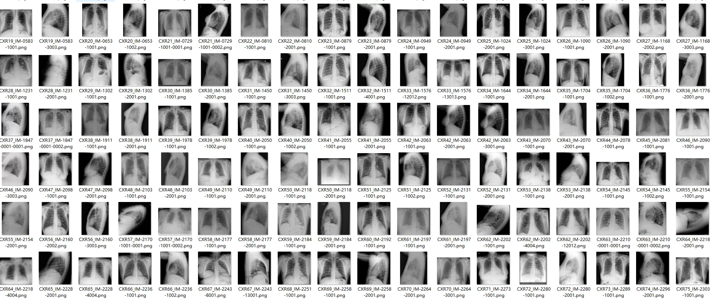
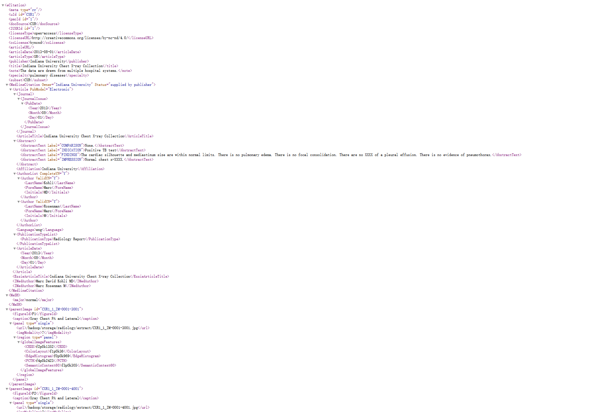
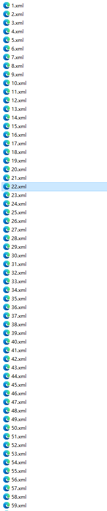
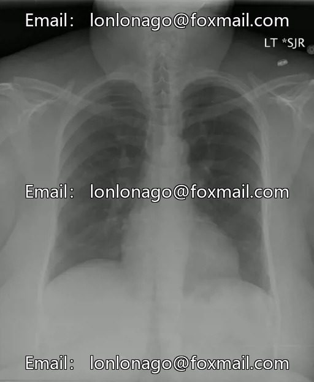
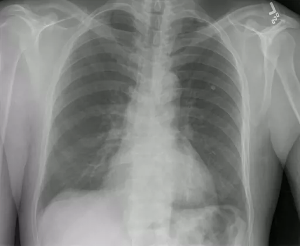
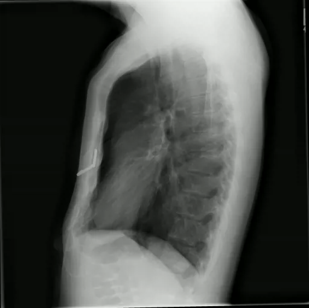

## Body

Chest X-ray Multimodal Dataset - Chest Film + Radiology Report Paired Multimodal Dataset

Data Scale: Approximately 3955 complete radiology reports (in XML format) + 7470 chest X-ray images (in PNG format) (each report can correspond to multiple chest films, strictly paired, suitable for multimodal tasks).

Core Purposes: Medical Multimodal Research (Image→Report Generation, Report→Image Retrieval, VQA), NLP Information Extraction, Pneumonia/Pulmonary Disease AI Classification, CV Image Analysis.

Electronic virtual products are not returnable or exchangeable.

## Images

item_1041614829368

Here is a pay link on Stripe ( https://buy.stripe.com/3cs8yP7sY87d0vu9AB ). Please contact me lonlonago@foxmail.com after funding $89, and I will send you a complete data files , thank you!

